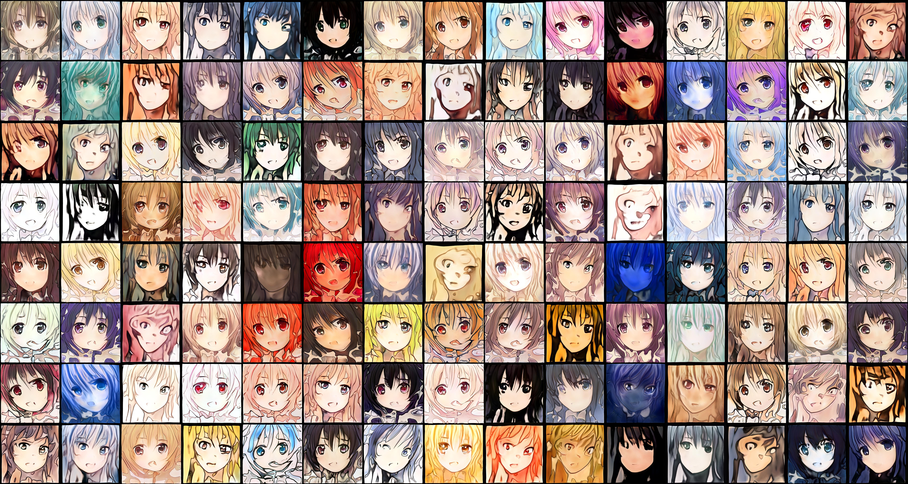

# DIGCRE-HS21-Anime-Face-GAN
This project was created for the modul **Digital Creativity** from HSLU.  

**Student:**  
Filip Krsmanovic  

## Project Idea
I was fascinated by  StyleGAN that we've learnt about in the seminar with Derrick Schultz. I knew instantly that I wanted to do my final project with StyleGAN. The idea I had in mind was first generating full-body anime characters, but in my opinion it was too much training time that it would take, to look kinda good, so I reduced it to anime faces only. Instead of just looking for an existing model and training on it, I decided to do the whole process of creating a dataset and training from basically zero.

## Process from Zero to Anime Face
### Looking for Ressources and Tools  
Dr. Google helped me to find an amazing page called www.gwern.net. On gwern I found a huge dataset with terabytes of anime pictures that were scrapped from google. Since I didn't need Terabytes I downloaded around 33GB of anime pictures (around 300k+ images)...  

### Preparing the dataset
Since It was a pretty big task to prepare 300k images and I wouldn't even need that much I reduced it to 6'000 images.  
The pictures I had were all anime related but there would often be multiple persons in the picture and a whole scenery. So I had to detect the faces and cut them out.  
  
**Step 1 - Detecting Anime Faces in pictures**  
The face detection was done with a face detector using OpenCV that I found on github (Link in Ressources). Most of the python code was from the given example but I had to change it a bit so I would crop out only one face and get an imidiate output of the face instead of the original image with red squares around the faces. I used a powershell script to run the python detecting script on each image. I did it like this because it was easier to code for me instead of doing all in python and running the plain python script. :D  
  
**Step 2 - Upscaling all the images to the same size**  
Now I had to make all the images to the same size of 512x512px but just changing the width and height wouldn't be optimal because the resolution would be horrible on some pictures. Once again I found a perfect tool for my needs on GitHub called "waifu2x ncnn Vulkan" (Link in Ressources). I wrote a small powershell-script that checked the size of the image and added an appropriate multipler parameter to waifu2x ncnn Vulkan to upscale with. Now I had all images upscaled and 512px or even bigger.  
  
**Step 3 - Getting all images to 512x512px**  
Some of the images got a multipler that simply couldn't get the image directly to 512x512px so I had to get them all to the same size. This was pretty easy since I could use Microsoft PowerToys that has a image resize utility built in.

### Getting into Training
Now that my dataset was finally prepared I was hyped for the training part.

**Step 1 - Finding a .pkl file** 
Because we learnt that it's always better to start training with a existing .pkl file that no .pkl file I downloaded a pre-trained model with real faces. (Link in Ressources)  

**Step 2 - Setting up the training colab notebook**  
Now I got myself colab-pro to enjoy some fine and powerful graphic card usage and set up the colab notebook with Derrick Schultz his notebook from the seminar as an outline.  

**Step 3 - Actual Training**
The actual training was performed for 47.5 hours in total. The latest .pkl file can be found on my github repo - feel free to use it :)

## Results  
So now to the interessting part! 
  
  
One of the first fake seeds 

Latest fake seeds after 47.5h training

**Linear Interpolation with 7 random seeds**  

## Problems faced during the project  
**Dataset Size for training**  
I planned to train with 5k+ images but for some reason I always got errors when trying to train with more than 250 images... I googled a lot for a solution but couldn't find any easy fix without touching the training python code. I also tried to train in a copy of Derrick his Notebook but couldn't make it run there either. So I guess for fixing the problem I would need to touch the training python code.  

**Crashes during training**  
I got unlucky sometimes and woke up the next day only to see that my training crashed or the internet disconnected / colab and I didn't get any snapshot out of it or just a few.  

**Deploying the Model**
One goal of mine was to deploy the model to a website and be able to generate images on button click. Unfortunately I didn't had the time ressources to do so and didn't find anything quick and easy to deploy. Huggingface.co seemend like a good solution but I couldn't wrap my head around the spaces thingy and didn't find any good tutorials for it.  

## Ressources  
www.gwern.net  
https://www.gwern.net/Danbooru2020#torrent  
https://github.com/nagadomi/lbpcascade_animeface  
https://github.com/nihui/waifu2x-ncnn-vulkan  
https://docs.microsoft.com/en-us/windows/powertoys/image-resizer  
https://github.com/justinpinkney/awesome-pretrained-stylegan2#faces-FFHQ-config-f-512x512  
https://huggingface.co/

